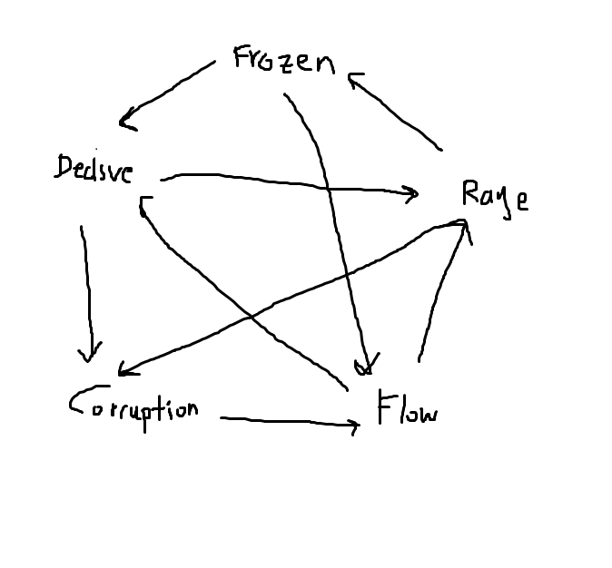

% Simple Dungeon Crawling Deck Builder
% Minyoung Heo

# Overview

A basic deck-builder where you need to collect minerals

You select a class.

# Core loop

The overall objective is to bring the opponent health to 0.

At the beginning of your turn, all status effects on you take effect (same goes for opponenet).

Each turn you can choose 1 out of 5 options:

1. Construct potion

    - This allows you to combine ingredients into a potion. Keep the gathered ingredients in a pile somewhere for convenient use and gain a potion token.

2. Place Potion

    - At the cost of a potion token, you can place a potion (the stack of all ingredients) onto a land. The land effects affect the potion stored in it each turn.

3. Throw Potion

    - Take a potion that your holding or storing and target its effects onto your opponent. (_Ex_: If your potion deals damage, throwing it will deal damage to your opponent. _Ex2_: If your potion heals, throwing it will heal your opponent.)

4. Drink Potion
  
    - Take a potion that your holding or storing and target its effects onto yourself (_Ex_: if your potion deals damage, it will deal damage to you. _Ex2_: if your potion heals, it will heal you.)

5. Skip your turn 

# Enemies

# Card Master List

## Locations

The mechanic is that you can store your potion in a certain location, each location specializing in each type of damage below. Placing your potion in a corruption location means all corruption effects increase by 1, but all things corruption is _weak_ to (Decisive, Rage) will decrease by 1. Each turn these modifications happen. The longer you store the potion, the stronger it gets.

## Types of Damage:

Overal chart:

* Frozen <- Rage <- Flow <- Corruption <- Decisive …

* Frozen -> Flow -> Decisive -> Rage -> Corruption …

_**Frozen**_ 

This kind of damage comes with negative side effects. It's meant to restrict the opponent from certain making choices.

_**Rage**_

This kind of damage is also primarily big. It deals massive damage, but also comes with more negative side effects.

_**Flow**_

This kind of damage is very _steady_. Mechanics like "being benefited from repetitive use" is kind of an idea of what kind of mechanic Flow is based on.

_**Corruption**_

This kind of damage is the poison of damage. It primarily focuses on dealing damage over time.

_**Decisive**_

This kind of damage is designed to be quick. Its damage is meant to be a priority

### Card Keywords: 

_**Infliction**_
At the start of the opponent's next turn, deals damage based on its value and decreases its value by 1

_**Frost**_
Reduces your damage dealt by half (rounded down)

_**Weak**_
Takes double damage from opponents

_**Adaptable**_
A neutral effect that turns into a specific type when mixed with other ingredients. It goes with the majority of the potion types. If it's a tie between multiple potion types, it will randomly choose one.

### Card Types:

* Quantifiers - these modify the numerical value of the effect of the potion

* Modifiers - these modify the effects of the potion
  
_**Master Card List**_
https://docs.google.com/spreadsheets/d/18WhHdy7mmHrYBu8RSTqJvJtDiZmmR1SvkhQmygA60s4/edit?usp=sharing
